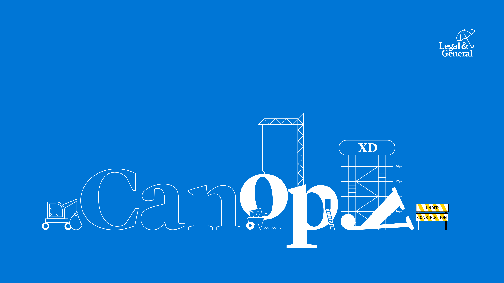

# Canopy

> An Angular implementation of the Legal & General design system.

Interested in [contributing?](docs/CONTRIBUTING.md)

Want to learn how to [use it in a project?](docs/USAGE.md)

Have an [issue you would like to raise?](./issues)
