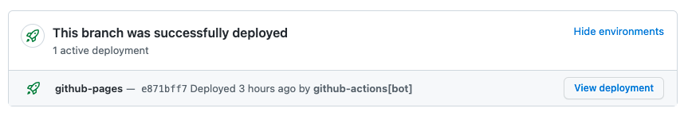

# Contributing

Hi, glad you are here all contributions are very much welcome!

Before you start Contributing to Canopy it is worth familiarising yourself with the [best practice](./BEST_PRACTICE.md) guidelines.

Please do raise an [issue](https://github.com/Legal-and-General/canopy/issues) or [discussion](https://github.com/Legal-and-General/canopy/discussions) before starting a piece of work. Our contributors can help provide guidance to make sure your effort isn't wasted. It is important that the development and design implementations stay in sync and that the codebase remains consistent. This will help to give the codebase a long life and remain intuitive for those using it.

## Storybook

Canopy uses [Storybook](https://storybook.js.org/) to enable components to be developed in isolation. If you are creating a new component or directive a corresponding story file will be needed.

Running `npm start` will run storybook locally, this will hot reload any changes and is the most seamless way to modify or create existing components.

### Deployments

Pull requests are deployed manually to [GitHub Pages](https://pages.github.com/) by the Core or Regular Contributors.
Once the deployment has completed successfully the pull request will be updated with the environment details.



The `master` branch is also deployed to GitHub Pages, this currently provides the most up-to-date documentation for the latest version.

https://legal-and-general.github.io/canopy

## Build

Run `npm run build` to build the library and global styles.

The build artifacts will be stored in the `dist/` directory.

### Build test application

A test application is located in the `projects/canopy-test-app` folder. This application helps to capture any issues with exported modules. Run `npm run build:test-app` to build the test application, this happens automatically as part of the pull request pipeline.

The test application includes a test page which contains all of the Canopy components to ensure that they layout correctly. This page is also accessible in storybook via the main navigation, where possible all new components should be added to the test page.

## Running unit tests

Run `npm test` to execute the library unit tests, this step is also run as part of the pull request pipeline.

## Running lint

Run `npm run lint` to execute the library unit tests, this step is also run as part of the pull request pipeline.

Current linting includes

- `eslint` and `prettier` for typescript, javascript and html files
- `stylelint` and `prettier` for scss files
- `prettier` for json files

## Conventional commits

This repository is set up to work with the [angular version](https://github.com/angular/angular/blob/master/CONTRIBUTING.md#-commit-message-guidelines) of [conventional commits](https://www.conventionalcommits.org).

A git commit-msg hook will lint your commits to ensure they are of the correct format. To make it easy to follow the correct format you can `npm run commit` which will use the [commitizen](https://github.com/commitizen/cz-cli) cli to run you through the process.

The commit message format is important as it is what drives the semantic versioning. Versioning is currently carried out by the [semantic release](https://semantic-release.gitbook.io/) node module. On merging to the master branch, semantic release will scan the commit messages and determine the next version. It will also tag, package and deploy this version to the [GitHub registry](https://github.com/features/package-registry).

### Breaking Changes

Be particularly aware of any changes which may be deemed a breaking change. Refer to our [guide of what is and is not considered a breaking change](./BREAKING_CHANGES.md)

The format for breaking changes is outlined on the [convention commit docs](https://www.conventionalcommits.org/en/v1.0.0-beta.2/#commit-message-with-description-and-breaking-change-in-body)

Whenever introducing a breaking change consider using the `next` branch. Refer to the [next docs](./NEXT_BRANCH.md).

### Commit message examples

Fix

```
fix(release): need to depend on latest rxjs and zone.js

The version in our package.json gets copied to the one we publish, and users need the latest of these.
```

Breaking change

```
feat(button): allow provided config object to extend other configs

BREAKING CHANGE: `extends` key in config file is now used for extending other config files
```

## Commit Signing

To ensure that changes come from an entrusted source all commits must be [signed](https://help.github.com/en/articles/about-commit-signature-verification), Follow the steps below to setup commit signing.

1. [Generating a new GPG Key](https://help.github.com/en/articles/generating-a-new-gpg-key)

   Make sure the email address you use, matches your local git email address (`git config --get user.email`) and that of your GitHub account. If not, either change your git email address or add this address to your GitHub account.

2. [Adding a new GPG key to your GitHub account](https://help.github.com/en/articles/adding-a-new-gpg-key-to-your-github-account)
3. [Signing commits](https://help.github.com/en/articles/signing-commits)

## Branch naming convention

Branches should be in `kebab-case` format.
The repository is set up with a `pre-push` hook that will prevent the user from pushing if the branch name doesn't match the correct format.

## Review Process

Pull requests require two successful approvals before they can be merged. One review must be from a [CODEOWNER](./.github/CODEOWNERS). We also require that developers working on a specific project seek review from someone on a different project. The aim being that by removing any immediate delivery pressure we can ensure a high level of quality and negate the risk of factions forming within the codebase, currently we cannot automate this process and so it must be based on trust.

### Code Owners

Code Owners are chosen based on a history of consistent contributions. Code Owners should have an understanding of the current issues list and have a wider view of the technical direction of the project. They should help to steer technical direction via pull request reviews and be focused on the longer term success of the project. Code Owners are not limited to being from our particular organisation.

## Github Actions

The build is currently handled by [Github Actions](https://help.github.com/en/actions), the config for which is checked into the [.github](./.github) directory. The build will run on every pull request and run standard verification tasks e.g. linting, unit testing, test build. The build will need to be green in order for a pull request to pass.

## SVG Icons

To add a new SVG icon to Canopy simply add the file to either the `icons` or `brand-icons` folder within `assets`.

When committing the new icons [lint-staged](https://github.com/okonet/lint-staged) will run and generate all the `ts` files automatically.

## Fonts

The Roboto font is stored in **/projects/canopy/src/assets/fonts/roboto** as normal and is included in the distributed Canopy package.

The Lyon font files are stored in **/assets/fonts** and omitted from the distributed package via the Webpack config. The `css-loader` options prevent it from transforming any URL referencing the Lyon font. This means the path will stay as relative to the base URL of the consuming application (/assets/fonts), therefore looking in the assets directory of consuming app.

For more info, see the fonts section in USAGE.md.

## Angular Material CDK
The `@angular/cdk` can be used as long as only the necessary functionality is imported. 

## Dependabot
The dependency updates are currently handled by [Dependabot](./DEPENDABOT.md).

