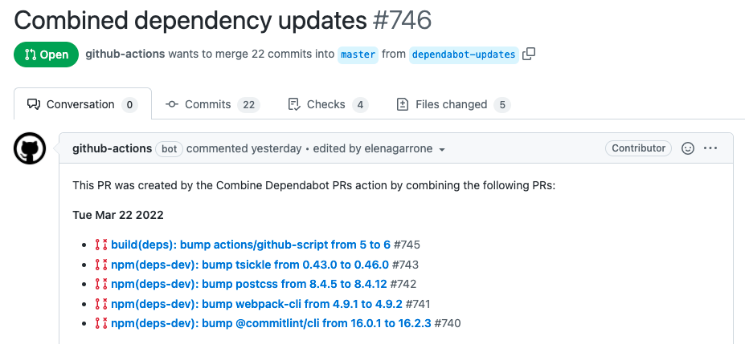

# Dependency updates with Dependabot

Dependabot is a GitHub-owned product that directly integrates into the GitHub UI and notifies us of new releases to our
dependencies within the npm and GitHub Actions package ecosystems.

> NOTE: The configuration file is found at `/.github/dependabot.yml`
## Dependency Updates

Dependabot takes into consideration the semver ranges within `/package.json` (or GitHub Actions workflow files for
updates to Actions) and will only notify us of updates that fall within the specified ranges. It does this by raising a
PR that updates the relevant files, and includes a link to release notes.

Because dependencies are updated regularly and Dependabot raises a lot of PRs, we choose not to handle these PRs
individually. The overhead in terms of both GitHub minutes consumption and the review process of all those PRs would be
too great. Therefore, Dependabot PRs do not run the pipeline checks and can not be merged.

So, how do we merge them?

### Dependabot Auto-batcher

We have a workflow that runs every Monday and Wednesday morning that will combine all open Dependabot PRs into one. The
PR title will be `Combined dependency updates` and it will link to the PRs it combined, as well as close them off. If
the PR is still open when it runs, the newly combined dependencies will be appended to the list, otherwise it will be
created.

The PR will look something like this:

This PR will run the full pipeline checks and should be reviewed and merged as normal.

### Conflicts

In the case where a Dependabot PR cannot be merged into the combined PR, it will be left alone. Conflicts usually occur
when consecutive packages within `/package.json` have been updated. To resolve this, merge the combined PR and the
workflow will include it within the next combined PR.

You can either wait for the next workflow run (Monday or Wednesday morning), or run the ad-hoc batcher, which does the
same thing on demand.
